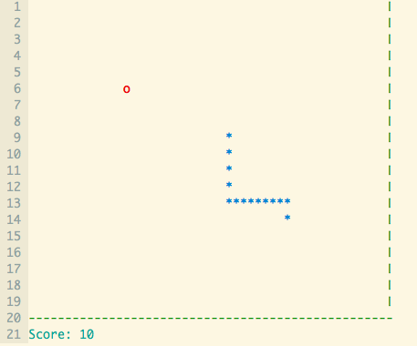

# Vim Snake
This is a snake game written in vimscript so that you can take a break
while coding and play a relaxing game of snake.

Control the snake with the hjkl keys (so that you can hone your vim movement
skills).



## Installation
You can install this plugin with your favorite plugin manager.

Vundle (for example):
```
Plugin 'zyedidia/vim-snake'
```

Start the game by running `:Snake`.

## Options
You can choose different options for the width/height of the play area:
```
let g:snake_rows = 20
let g:snake_cols = 50
```

You can also choose the update time (millisecond delay between frame updates):
```
let g:snake_update = 125
```

## How does it work?

The game loop is run by abusing the `CursorHold` autocommand. If no keys are
pressed for a certain amount of time, the autocommand will be triggered. Notice
that if you hold down a key during the game, the loop stops.

You can read about this trick [here](http://vim.wikia.com/wiki/Timer_to_execute_commands_periodically).
